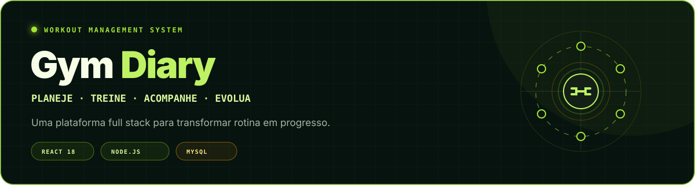
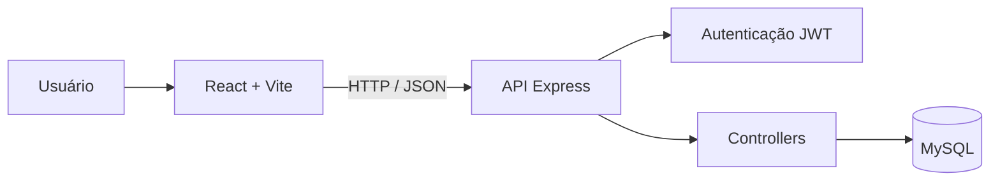

<div align="center">
  
</div>

<div align="center">

[](https://react.dev/)
[](https://nodejs.org/)
[](https://expressjs.com/)
[](https://www.mysql.com/)
[](gym-diary/LICENSE)

**Planeje sua semana, execute cada série e acompanhe sua evolução em um único lugar.**

</div>

## Sobre o projeto

O **Gym Diary** é uma aplicação web full stack para gerenciamento de treinos. A plataforma permite criar fichas personalizadas, organizar uma rotina semanal, registrar séries, repetições e cargas durante a execução e consultar a evolução ao longo do tempo.

O projeto foi desenvolvido como trabalho acadêmico, com orientação do professor [Hudson Neves](https://github.com/HudsonNeves), e reúne frontend responsivo, API REST, autenticação e persistência em banco de dados relacional.

## Demonstração

### Desktop

<div align="center">
  
</div>

### Mobile

<div align="center">
  
</div>

## Principais funcionalidades

| Área | Recursos |
|---|---|
| **Conta e acesso** | Cadastro, login com JWT, rotas protegidas e controle administrativo |
| **Treinos** | Criação e edição de fichas, exercícios e séries padrão |
| **Rotina semanal** | Associação de treinos a cada dia da semana |
| **Modo de execução** | Registro de séries, repetições, carga e progresso durante o treino |
| **Histórico** | Consulta de treinos concluídos e detalhes de cada sessão |
| **Progresso** | Indicadores e gráficos baseados no histórico registrado |
| **Administração** | Gerenciamento de usuários por contas administrativas |
| **Experiência** | Interface responsiva e transições com Framer Motion |

## Tecnologias

```text
Frontend       React 18 · Vite · React Router · Framer Motion · Recharts
Backend        Node.js · Express · JWT · bcrypt
Banco de dados MySQL · mysql2
Deploy         Render Blueprint
```

## Arquitetura



O frontend consome a API por meio de `VITE_API_URL`. No backend, as rotas delegam as regras aos controllers, enquanto o acesso ao MySQL é centralizado em um pool de conexões.

## Como executar

### Pré-requisitos

- Node.js 18 ou superior
- npm 9 ou superior
- MySQL 5.7 ou superior

### 1. Clone e acesse a aplicação

```bash
git clone https://github.com/Julio5630/gym-diary.git
cd gym-diary/gym-diary
```

### 2. Configure o backend

```bash
cd backend
npm install
```

Crie `backend/.env`:

```env
PORT=3000
NODE_ENV=development

DB_HOST=localhost
DB_PORT=3306
DB_USER=root
DB_PASSWORD=sua_senha
DB_NAME=gym_diary

JWT_SECRET=troque_por_uma_chave_longa_e_aleatoria
```

Inicie a API:

```bash
npm run dev
```

A inicialização cria o banco e as tabelas necessárias. A API ficará disponível em `http://localhost:3000`.

### 3. Configure o frontend

Em outro terminal:

```bash
cd gym-diary/frontend
npm install
```

Crie `frontend/.env`:

```env
VITE_API_URL=http://localhost:3000/api
```

Inicie a interface:

```bash
npm run dev
```

Acesse `http://localhost:5173`.

> [!IMPORTANT]
> A inicialização atual cria uma conta administrativa de desenvolvimento.

Para uma configuração mais detalhada, consulte o [guia de instalação](gym-diary/INSTALLATION.md).

## Scripts disponíveis

| Diretório | Comando | Finalidade |
|---|---|---|
| `frontend` | `npm run dev` | Servidor de desenvolvimento do Vite |
| `frontend` | `npm run build` | Build otimizado para produção |
| `frontend` | `npm run preview` | Prévia local do build |
| `backend` | `npm run dev` | API com reinicialização automática |
| `backend` | `npm start` | API em modo de produção |

<details>
<summary><strong>Principais rotas da API</strong></summary>

Todas as rotas abaixo usam o prefixo `/api`.

| Grupo | Rotas |
|---|---|
| Autenticação | `POST /auth/register`, `POST /auth/login`, `GET /me` |
| Exercícios | `GET/POST /exercises`, `PUT/DELETE /exercises/:id` |
| Fichas | `GET/POST /templates`, `GET/PUT/DELETE /templates/:id` |
| Rotina | `GET/POST /routines`, `DELETE /routines/:day` |
| Histórico | `GET/POST /history`, `GET /history/:id`, `POST /history/:workoutId/sets` |
| Usuários | `GET/POST /users`, `PUT/DELETE /users/:id` — somente administradores |
| Saúde da API | `GET /health` |

</details>

<details>
<summary><strong>Estrutura do projeto</strong></summary>

```text
gym-diary/
├── backend/
│   ├── config/          # Conexão com MySQL
│   ├── controllers/     # Regras da aplicação
│   ├── middlewares/     # Autenticação e validação
│   ├── routes/          # Endpoints da API
│   ├── utils/           # Exercícios padrão e utilitários
│   ├── app.js           # Configuração do Express
│   ├── init-db.js       # Criação inicial do banco
│   └── server.js        # Entrada do backend
├── frontend/
│   ├── public/
│   └── src/
│       ├── components/
│       ├── contexts/
│       ├── pages/
│       ├── services/
│       └── utils/
├── CONTRIBUTING.md
├── INSTALLATION.md
├── LICENSE
└── render.yaml
```

</details>

## Próximos passos

- [ ] Remover credenciais padrão do fluxo de inicialização
- [ ] Adicionar testes automatizados ao frontend e à API
- [ ] Aplicar validação de entrada em todas as rotas
- [ ] Restringir CORS por ambiente
- [ ] Adicionar recuperação de senha
- [ ] Criar versão instalável como PWA
- [ ] Integrar metas e recordes pessoais

## Contribuição

Sugestões e contribuições são bem-vindas. Consulte o [guia de contribuição](gym-diary/CONTRIBUTING.md) antes de abrir um pull request.

## Licença

Distribuído sob a licença MIT. Consulte [`LICENSE`](gym-diary/LICENSE) para mais informações.

<div align="center">
  Desenvolvido por <a href="https://github.com/Julio5630">Júlio César</a>
</div>
